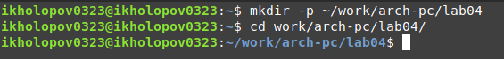
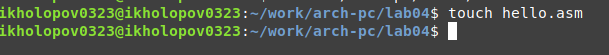
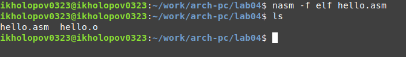
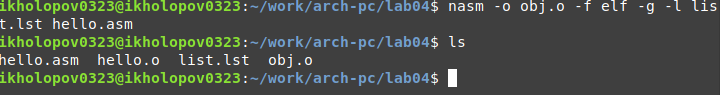
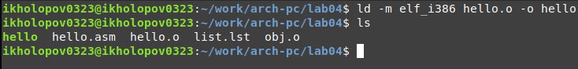
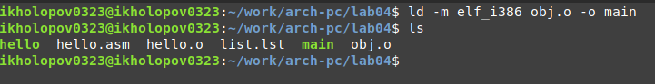
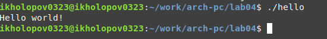
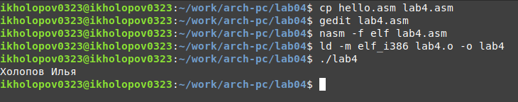
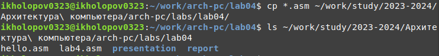

---
## Front matter
title: "ОТЧЕТ ПО ЛАБОРАТОРНОЙ РАБОТЕ №4"
subtitle: "дисциплина: Архитектура компьютера"
author: "Холопов Илья Алексеевич"

## Generic otions
lang: ru-RU
toc-title: "Содержание"

## Bibliography
bibliography: bib/cite.bib
csl: pandoc/csl/gost-r-7-0-5-2008-numeric.csl

## Pdf output format
toc: true # Table of contents
toc-depth: 2
lof: true # List of figures
lot: true # List of tables
fontsize: 12pt
linestretch: 1.5
papersize: a4
documentclass: scrreprt
## I18n polyglossia
polyglossia-lang:
  name: russian
  options:
	- spelling=modern
	- babelshorthands=true
polyglossia-otherlangs:
  name: english
## I18n babel
babel-lang: russian
babel-otherlangs: english
## Fonts
mainfont: PT Serif
romanfont: PT Serif
sansfont: PT Sans
monofont: PT Mono
mainfontoptions: Ligatures=TeX
romanfontoptions: Ligatures=TeX
sansfontoptions: Ligatures=TeX,Scale=MatchLowercase
monofontoptions: Scale=MatchLowercase,Scale=0.9
## Biblatex
biblatex: true
biblio-style: "gost-numeric"
biblatexoptions:
  - parentracker=true
  - backend=biber
  - hyperref=auto
  - language=auto
  - autolang=other*
  - citestyle=gost-numeric
## Pandoc-crossref LaTeX customization
figureTitle: "Рис."
tableTitle: "Таблица"
listingTitle: "Листинг"
lofTitle: "Список иллюстраций"
lotTitle: "Список таблиц"
lolTitle: "Листинги"
## Misc options
indent: true
header-includes:
  - \usepackage{indentfirst}
  - \usepackage{float} # keep figures where there are in the text
  - \floatplacement{figure}{H} # keep figures where there are in the text
---

# Цель работы

Освоение процедуры компиляции и сборки программ, написанных на ассемблере NASM.

# Выполнение лабораторной работы

Создадим и перейдем в каталог для работы с программами на языке ассемблера NASM (рис. @fig:001).

{#fig:001 width=70%}

Создадим текстовый файл hello.asm и введем в него текст программы на языке ассемблер (рис. @fig:002).

{#fig:002 width=70%}

Скомпилируем файл hello.asm (рис. @fig:003).

{#fig:003 width=70%}

Скомпилируем исходный файл hello.asm в obj.o (рис. @fig:004).

{#fig:004 width=70%}

Чтобы получить исполняемую программу, объектный файл передадим на обработку компоновщику (рис. @fig:005).

{#fig:005 width=70%}

Выполним следующую команду ld -m elf_i386 obj.o -o main. В результате будет собран исполняемый файл main из объектного obj.o (рис. @fig:006).

{#fig:006 width=70%}

Запустим исполняемый файл hello. В результате выполнения программы в консоль выводится сообщение "Hello world!" (рис. @fig:007).

{#fig:007 width=70%}

В каталоге ~/work/arch-pc/lab04 с помощью команды cp создадим копию файла hello.asm с именем lab4.asm. Внесем изменения в файл lab4.asm с помощью текстового редактора gedit такмм образом, чтобы вместо "Hello world!" выводилось имя и фамилия и убедимся, что программа выводит имя и фамилию (рис. @fig:008).

{#fig:008 width=70%}

Скопируем файлы hello.asm и lab4.asm в локальный репозиторий в каталог ~/work/study/2023-2024/"Архитектура компьютера"/arch-pc/labs/lab04/.

{#fig:009 width=70%}

# Выводы

В результате выполнения лабораторной работы были освоены процедуры компиляции и сборки программ, написанных на ассемблере NASM. А также созданы 2 программы выводящие сообщение в консоль.
