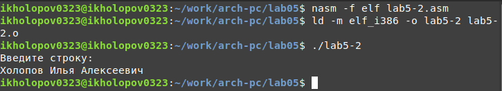

---
## Front matter
title: "ОТЧЕТ ПО ЛАБОРАТОРНОЙ РАБОТЕ №5"
subtitle: "дисциплина: Архитектура компьютера"
author: "Холопов Илья Алексеевич"

## Generic otions
lang: ru-RU
toc-title: "Содержание"

## Bibliography
bibliography: bib/cite.bib
csl: pandoc/csl/gost-r-7-0-5-2008-numeric.csl

## Pdf output format
toc: true # Table of contents
toc-depth: 2
lof: true # List of figures
lot: true # List of tables
fontsize: 12pt
linestretch: 1.5
papersize: a4
documentclass: scrreprt
## I18n polyglossia
polyglossia-lang:
  name: russian
  options:
	- spelling=modern
	- babelshorthands=true
polyglossia-otherlangs:
  name: english
## I18n babel
babel-lang: russian
babel-otherlangs: english
## Fonts
mainfont: PT Serif
romanfont: PT Serif
sansfont: PT Sans
monofont: PT Mono
mainfontoptions: Ligatures=TeX
romanfontoptions: Ligatures=TeX
sansfontoptions: Ligatures=TeX,Scale=MatchLowercase
monofontoptions: Scale=MatchLowercase,Scale=0.9
## Biblatex
biblatex: true
biblio-style: "gost-numeric"
biblatexoptions:
  - parentracker=true
  - backend=biber
  - hyperref=auto
  - language=auto
  - autolang=other*
  - citestyle=gost-numeric
## Pandoc-crossref LaTeX customization
figureTitle: "Рис."
tableTitle: "Таблица"
listingTitle: "Листинг"
lofTitle: "Список иллюстраций"
lotTitle: "Список таблиц"
lolTitle: "Листинги"
## Misc options
indent: true
header-includes:
  - \usepackage{indentfirst}
  - \usepackage{float} # keep figures where there are in the text
  - \floatplacement{figure}{H} # keep figures where there are in the text
---

# Цель работы

Приобретение практических навыков работы в Midnight Commander. Освоение инструкций языка ассемблера mov и int.

# Выполнение лабораторной работы

Создадим c помощью midnight commander подкаталог lab05 в каталоге ~/work/arch-pc (рис. @fig:001).

{#fig:001 width=70%}

Пользуясь строкой ввода и командой touch, создадим файл lab5-1.asm в созданном каталоге (рис. @fig:002).

{#fig:002 width=70%}

Отредактируем с помощью midnight commander файл lab5-1.asm и выведем содержимое на экран (рис. @fig:003).

{#fig:003 width=70%}

Оттранслируем текст программы lab5-1.asm в объектный файл, выполним компоновку объектного файла и запустим получившийся исполняемый файл (рис. @fig:004).

{#fig:004 width=70%}

Скопируем с курса ТУИС файл in_out.asm в каталог с файлом lab5-1.asm и создадим копию файла lab5-1.asm с именем lab5-2.asm (рис. @fig:005).

{#fig:005 width=70%}

Исправим текст программы lab5-2.asm с использованием подпрограмм из внешнего файла in_out.asm (рис. @fig:006).

{#fig:006 width=70%}

Оттранслируем текст программы lab5-2.asm в объектный файл, выполним компоновку объектного файла и запустим получившийся исполняемый файл (рис. @fig:007).

{#fig:007 width=70%}

В файле lab5-2.asm заменим подпрограмму sprintLF на sprint. Создадим исполняемый файл и проверим его работу.  На рис. @fig:008 видно, что sprint в отличии от sprintLF не выводит символ перевода строки.

{#fig:008 width=70%}

Создадим копию файла lab5-1.asm с именем lab5-3.asm. Внесем изменения в программу (без использования внешнего файла in_out.asm), так чтобы выводилось приглашение "Введите строку:", вводилось строка с клавиатуры, выводилось введенная строка на экран (рис. @fig:009).

{#fig:009 width=70%}

Создадим копию файла lab5-2.asm с именем lab5-4.asm. Внесем изменения в программу (с использованием внешнего файла in_out.asm), так чтобы выводилось приглашение "Введите строку:", вводилось строка с клавиатуры, выводилось введенная строка на экран (рис. @fig:010).

{#fig:010 width=70%}

# Выводы

Здесь кратко описываются итоги проделанной работы были изучены инструкции языка ассемблера mov и int, а также освоены навыки работы в Midnight Commander.

