---
## Front matter
title: "ОТЧЕТ ПО ЛАБОРАТОРНОЙ РАБОТЕ №6"
subtitle: "дисциплина: Архитектура компьютера"
author: "Холопов Илья Алексеевич"

## Generic otions
lang: ru-RU
toc-title: "Содержание"

## Bibliography
bibliography: bib/cite.bib
csl: pandoc/csl/gost-r-7-0-5-2008-numeric.csl

## Pdf output format
toc: true # Table of contents
toc-depth: 2
lof: true # List of figures
lot: true # List of tables
fontsize: 12pt
linestretch: 1.5
papersize: a4
documentclass: scrreprt
## I18n polyglossia
polyglossia-lang:
  name: russian
  options:
    - spelling=modern
    - babelshorthands=true
polyglossia-otherlangs:
  name: english
## I18n babel
babel-lang: russian
babel-otherlangs: english
## Fonts
mainfont: PT Serif
romanfont: PT Serif
sansfont: PT Sans
monofont: PT Mono
mainfontoptions: Ligatures=TeX
romanfontoptions: Ligatures=TeX
sansfontoptions: Ligatures=TeX,Scale=MatchLowercase
monofontoptions: Scale=MatchLowercase,Scale=0.9
## Biblatex
biblatex: true
biblio-style: "gost-numeric"
biblatexoptions:
  - parentracker=true
  - backend=biber
  - hyperref=auto
  - language=auto
  - autolang=other*
  - citestyle=gost-numeric
## Pandoc-crossref LaTeX customization
figureTitle: "Рис."
tableTitle: "Таблица"
listingTitle: "Листинг"
lofTitle: "Список иллюстраций"
lotTitle: "Список таблиц"
lolTitle: "Листинги"
## Misc options
indent: true
header-includes:
  - \usepackage{indentfirst}
  - \usepackage{float} # keep figures where there are in the text
  - \floatplacement{figure}{H} # keep figures where there are in the text
---

# Цель работы

Освоение арифметических инструкций языка ассемблера NASM.

# Выполнение лабораторной работы

Создадим каталог для лабораторной работы № 6, перейдем в него и создадим файл lab6-1.asm (рис. @fig:001).

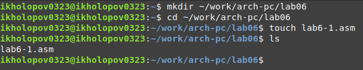{#fig:001 width=70%}

Введем в файл lab6-1.asm текст программы. В данной программе в регистр eax записывается символ 6 (mov eax,'6'), в регистр ebx символ 4 (mov ebx,'4'). Далее к значению в регистре eax прибавляем значение регистра ebx (add eax,ebx, результат сложения запишется в регистр eax). Далее выводим результат. Так как для работы функции sprintLF в регистр eax должен быть записан адрес, необходимо использовать дополнительную переменную. Для этого запишем значение регистра eax в переменную buf1 (mov [buf1],eax), а затем запишем адрес переменной buf1 в регистр eax (mov eax,buf1) и вызовем функцию sprintLF (рис. @fig:002).

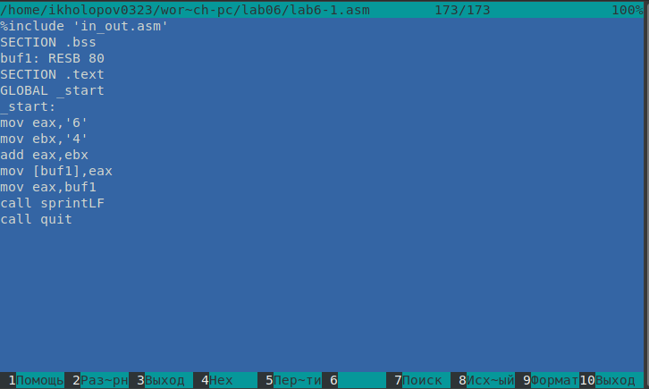{#fig:002 width=70%}

Создадим исполняемый файл и запустим его (рис. @fig:003).

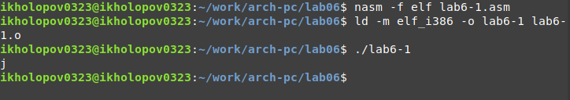{#fig:003 width=70%}

Далее изменим текст программы, вместо символов запишем в регистры числа. Создадим и запустим исполняемый файл. В результате программа выводит символ с кодом 10, т.е символ перевода строки (рис. @fig:004).

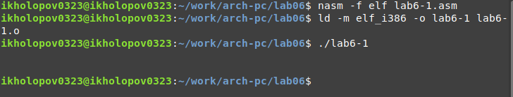{#fig:004 width=70%}

Для работы с числами в файле in_out.asm реализованы подпрограммы для преобразования ASCII символов в числа и обратно. Преобразуем текст программы из lab6-1.asm с использованием этих функций. (рис. @fig:005).

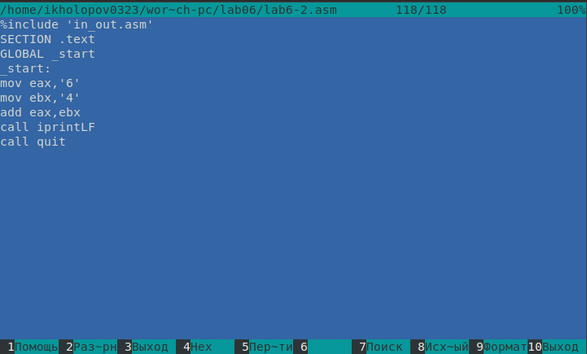{#fig:005 width=70%}

Создадим исполняемый файл и запустим его (рис. @fig:006).

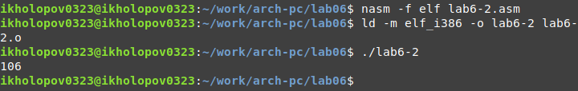{#fig:006 width=70%}

Теперь изменим символы на числа. Создадим и запустим исполняемый файл. На  рис. @fig:007 видно, что в результате выводится на экран число 10.

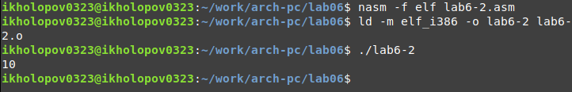{#fig:007 width=70%}

Заменим функцию iprintLF на iprint. Создадим исполняемый файл и запустим его. На рис. @fig:008 видно, что iprint в отличии от iprintLF не выводит символ перевода строки.

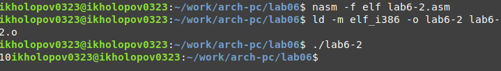{#fig:008 width=70%}

Создадим файл lab6-3.asm в каталоге ~/work/arch-pc/lab06.  (рис. @fig:009).

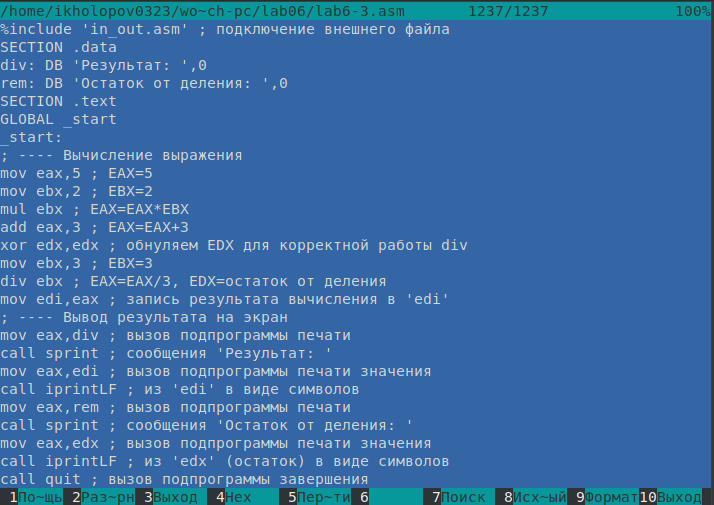{#fig:009 width=70%}

Создадим исполняемый файл и запустим его (рис. @fig:010).

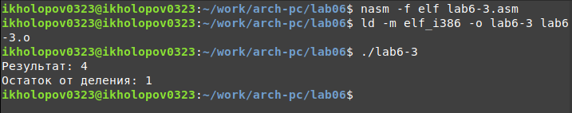{#fig:010 width=70%}

Изменим текст программы для вычисления выражения $f(x) = (4 ∗ 6 + 2)/5$. Создадим исполняемый файл и проверим его работу (рис. @fig:011).

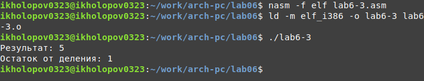{#fig:011 width=70%}

Создадим файл variant.asm в каталоге ~/work/arch-pc/lab06. Напишем в файле variant.asm код программы, вычисляющей вариант по номеру введенного с клавиатуры (рис. @fig:012).

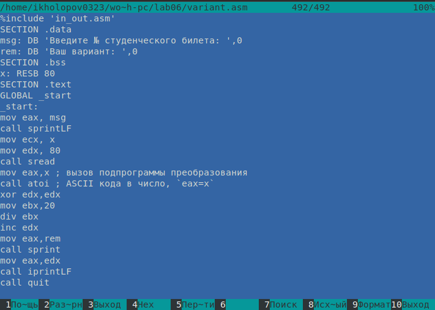{#fig:012 width=70%}

Создадим исполняемый файл и запустим его (рис. @fig:013).

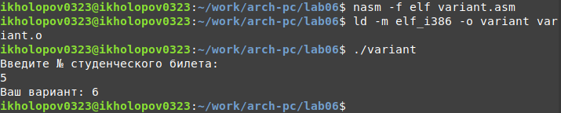{#fig:013 width=70%}

Следующие строки отвечают за вывод на экран сообщения ‘Ваш вариант:’:

```asm
mov eax,rem
call sprint
```

Данные введенные с клавиатуры записываются в x:

```asm
mov ecx, x
mov edx, 80
call sread
```

Инструкция “call atoi” используется для перевода ASCII кода в число.

Следующие строки отвечают за вычисление варианта:

```asm
xor edx,edx
mov ebx,20
div ebx
inc edx
```

В регистр edx записывается остаток от деления при выполнении инструкции “div ebx”. Инструкция “inc edx” используется, так как необходимо вычислить остаток от от деления на 20 и прибавить 1.

Следующие строки отвечают за вывод на экран результата вычислений:

```asm
mov eax,edx
call iprintLF
```

Напишем программу для вычисления выражения $y = f(x) = (9x - 8)/8$ (рис. @fig:014).

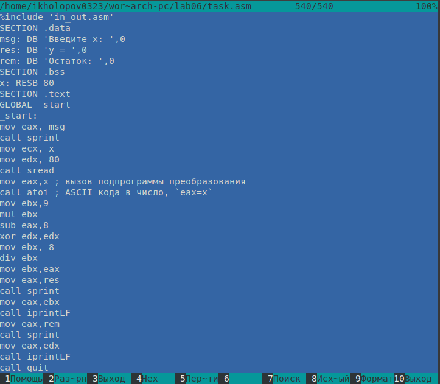{#fig:014 width=70%}

Создадим исполняемый файл и запустим его (рис. @fig:014).

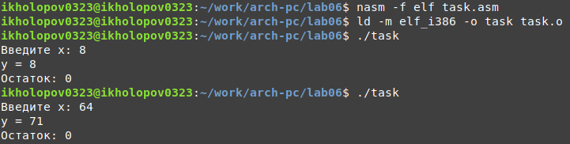{#fig:015 width=70%}

# Выводы

В результате выполнения лабораторной работы были освоены арифметические инструкции языка ассемблера NASM, созданы программы для вычисления выражений.

