---
## Front matter
title: "ОТЧЕТ ПО ЛАБОРАТОРНОЙ РАБОТЕ №7"
subtitle: "дисциплина: Архитектура компьютера"
author: "Холопов Илья Алексеевич"

## Generic otions
lang: ru-RU
toc-title: "Содержание"

## Bibliography
bibliography: bib/cite.bib
csl: pandoc/csl/gost-r-7-0-5-2008-numeric.csl

## Pdf output format
toc: true # Table of contents
toc-depth: 2
lof: true # List of figures
lot: true # List of tables
fontsize: 12pt
linestretch: 1.5
papersize: a4
documentclass: scrreprt
## I18n polyglossia
polyglossia-lang:
  name: russian
  options:
    - spelling=modern
    - babelshorthands=true
polyglossia-otherlangs:
  name: english
## I18n babel
babel-lang: russian
babel-otherlangs: english
## Fonts
mainfont: PT Serif
romanfont: PT Serif
sansfont: PT Sans
monofont: PT Mono
mainfontoptions: Ligatures=TeX
romanfontoptions: Ligatures=TeX
sansfontoptions: Ligatures=TeX,Scale=MatchLowercase
monofontoptions: Scale=MatchLowercase,Scale=0.9
## Biblatex
biblatex: true
biblio-style: "gost-numeric"
biblatexoptions:
  - parentracker=true
  - backend=biber
  - hyperref=auto
  - language=auto
  - autolang=other*
  - citestyle=gost-numeric
## Pandoc-crossref LaTeX customization
figureTitle: "Рис."
tableTitle: "Таблица"
listingTitle: "Листинг"
lofTitle: "Список иллюстраций"
lotTitle: "Список таблиц"
lolTitle: "Листинги"
## Misc options
indent: true
header-includes:
  - \usepackage{indentfirst}
  - \usepackage{float} # keep figures where there are in the text
  - \floatplacement{figure}{H} # keep figures where there are in the text
---

# Цель работы

Изучение команд условного и безусловного переходов. Приобретение навыков написания программ с использованием переходов. Знакомство с назначением и структурой файла листинга.

# Выполнение лабораторной работы

Создадим каталог для лабораторной работы № 7, перейдем в него и создадим файл lab7-1.asm (рис. @fig:001).

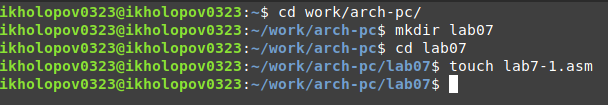{#fig:001 width=70%}

Введем в файл lab7-1.asm текст программы с использованием инструкции jmp (рис. @fig:002).

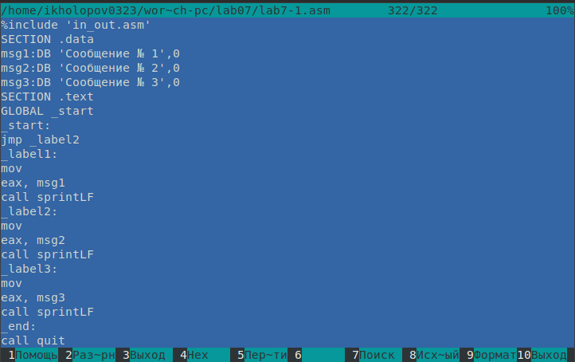{#fig:002 width=70%}

Создадим исполняемый файл и запустим его (рис. @fig:003).

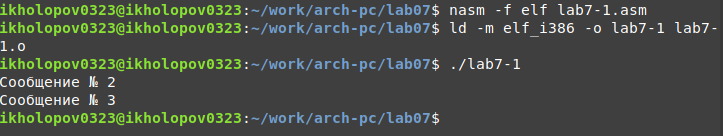{#fig:003 width=70%}

Изменим программу таким образом, чтобы она выводила сначала ‘Сообщение № 2’, потом ‘Сообщение№ 1’ и завершала работу (рис. @fig:004).

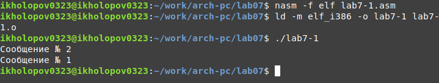{#fig:004 width=70%}

Снова измение программу, чтобы она выводила сначала ‘Сообщение № 3’, потом ‘Сообщение № 2’, потом ‘Сообщение№ 1’ и завершала работу (рис. @fig:005).

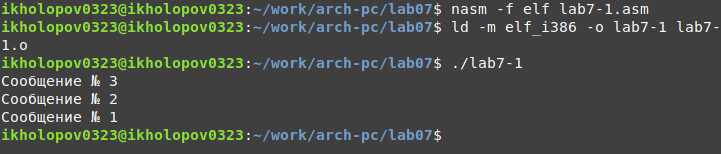{#fig:005 width=70%}

Создадим файл lab7-2.asm и введем в него текст программы, выводящей на экран наибольшее из трех значений (рис. @fig:006).

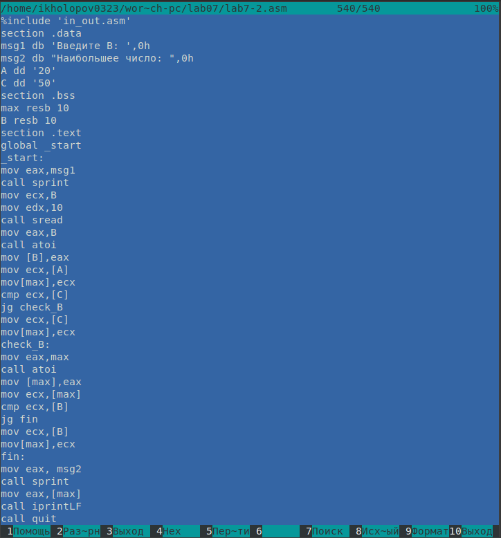{#fig:006 width=70%}

Создадим исполняемый файл и запустим его (@fig:007).

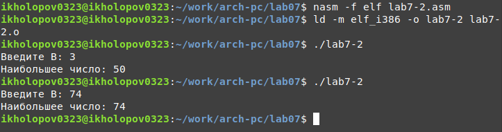{#fig:007 width=70%}

Создадим файл листинга для программы из файла lab7-2.asm и откроем его. В 15 строке 0000000B - адрес, 29D8 - машинный код sub eax,ebx. В 16 строке 0000000D - адрес, 5B - машинный код pop ebx. В 17 строке 0000000E - адрес, C3 - машинынй код ret (@fig:008).

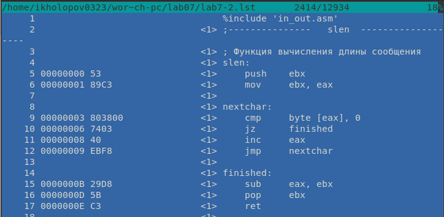{#fig:008 width=70%}

Откроем файл с программой lab7-2.asm и в любой инструкции с двумя операндами удалим один операнд. Выполним трансляцию с получением файла листинга на рис. @fig:009 видно в 13 строке информацию об ошибке.

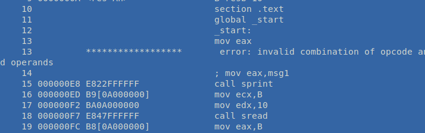{#fig:009 width=70%}

Напишем программу нахождения наименьшей из 3 целочисленных переменных 54, 62 и 87 (рис. @fig:010).

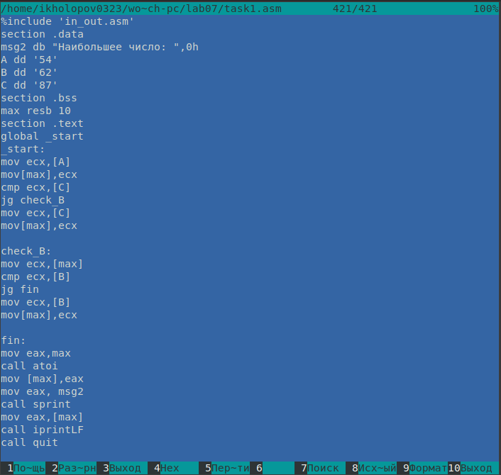{#fig:010 width=70%}

Создадим и запустим исполняемый файл (рис. @fig:011).

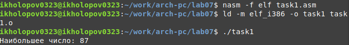{#fig:011 width=70%}

Напишем программу, которая для введенных с клавиатуры значений x и a вычисляет значение заданной функции $f(x) = 2x-a,x > a$ или $f(x) = 15,x <= a$. и выводит результат вычислений (рис. @fig:012).

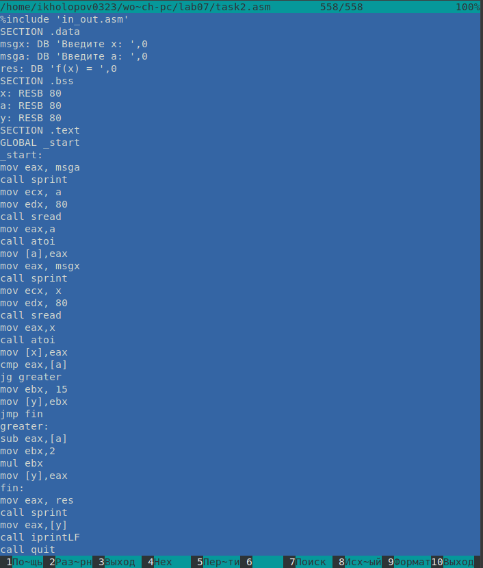{#fig:012 width=70%}

Создадим исполняемый файл и запустим его (рис. @fig:013).

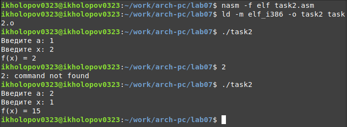{#fig:013 width=70%}

# Выводы

В результате выполнения работы были изучены команды условного и безусловного переходов, приобретены навыки написания программ с использованием переходов.

