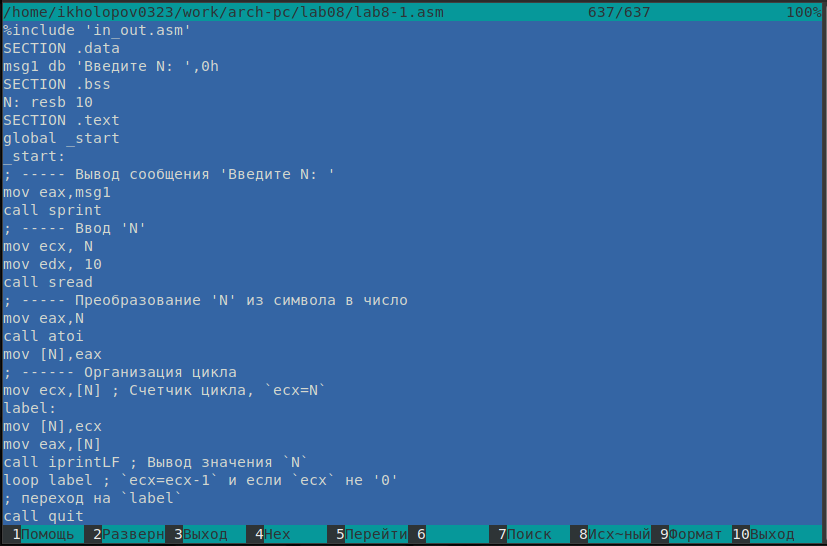
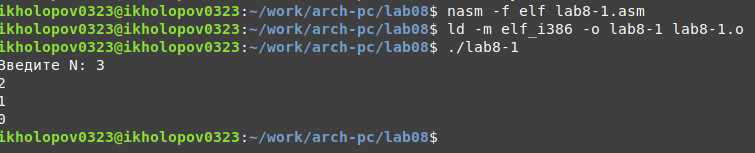
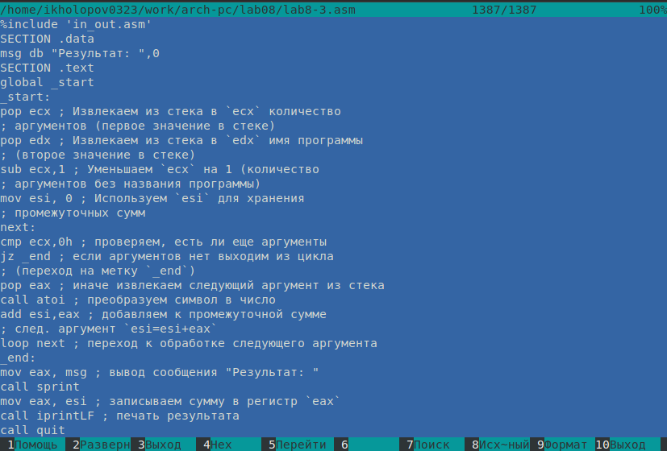
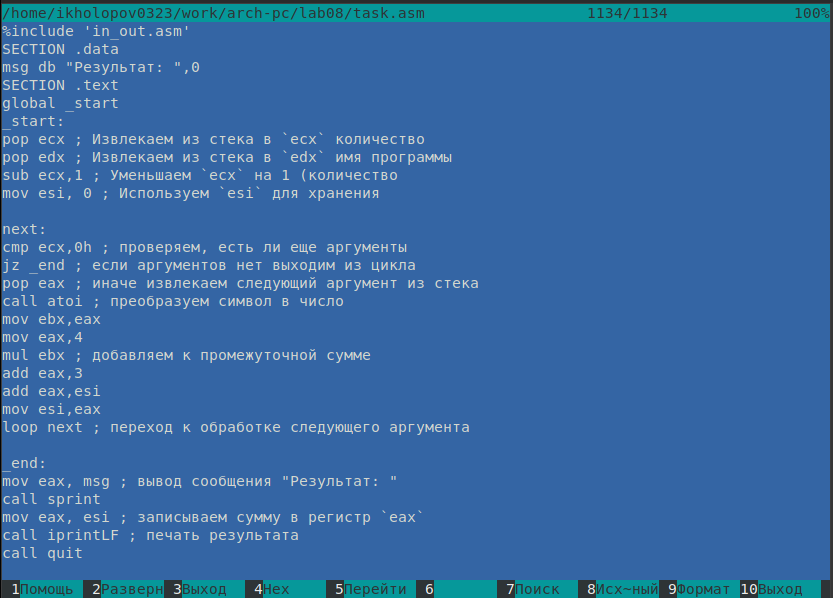

---
## Front matter
title: "ОТЧЕТ ПО ЛАБОРАТОРНОЙ РАБОТЕ №8"
subtitle: "дисциплина: Архитектура компьютера"
author: "Холопов Илья Алексеевич"

## Generic otions
lang: ru-RU
toc-title: "Содержание"

## Bibliography
bibliography: bib/cite.bib
csl: pandoc/csl/gost-r-7-0-5-2008-numeric.csl

## Pdf output format
toc: true # Table of contents
toc-depth: 2
lof: true # List of figures
lot: true # List of tables
fontsize: 12pt
linestretch: 1.5
papersize: a4
documentclass: scrreprt
## I18n polyglossia
polyglossia-lang:
  name: russian
  options:
    - spelling=modern
    - babelshorthands=true
polyglossia-otherlangs:
  name: english
## I18n babel
babel-lang: russian
babel-otherlangs: english
## Fonts
mainfont: PT Serif
romanfont: PT Serif
sansfont: PT Sans
monofont: PT Mono
mainfontoptions: Ligatures=TeX
romanfontoptions: Ligatures=TeX
sansfontoptions: Ligatures=TeX,Scale=MatchLowercase
monofontoptions: Scale=MatchLowercase,Scale=0.9
## Biblatex
biblatex: true
biblio-style: "gost-numeric"
biblatexoptions:
  - parentracker=true
  - backend=biber
  - hyperref=auto
  - language=auto
  - autolang=other*
  - citestyle=gost-numeric
## Pandoc-crossref LaTeX customization
figureTitle: "Рис."
tableTitle: "Таблица"
listingTitle: "Листинг"
lofTitle: "Список иллюстраций"
lotTitle: "Список таблиц"
lolTitle: "Листинги"
## Misc options
indent: true
header-includes:
  - \usepackage{indentfirst}
  - \usepackage{float} # keep figures where there are in the text
  - \floatplacement{figure}{H} # keep figures where there are in the text
---

# Цель работы

Приобретение навыков написания программ с использованием циклов и обработкой
аргументов командной строки.

# Выполнение лабораторной работы

Создадим каталог для лабораторной работы № 8, перейдем в него и создадим файл lab8-1.asm (рис. @fig:001).

{#fig:001 width=70%}

Введем в файл lab8-1.asm текст программы с использованием цикла (рис. @fig:002).

{#fig:002 width=70%}

Создадим исполняемый файл и запустим его (рис. @fig:003).

{#fig:003 width=70%}

Изменим программу таким образом, чтобы в цикле loop использовался регистр ecx. На рис. @fig:004 видно, что вывод программы не соответствует введенному числу N.

{#fig:004 width=70%}

Снова измение программу, чтобы она использовала стек для ecx (рис. @fig:005). В данном случае вывод программы соответствует введенному числу N.

{#fig:005 width=70%}

Создадим файл lab8-2.asm и введем в него текст программы, используещей аргументы командной строки (рис. @fig:006). 

{#fig:006 width=70%}

Создадим исполняемый файл и запустим его, указав аргументы (@fig:007). Программа обработала 5 аргументов: имя программы, аргумент1, аргумент, 2, 'аргумент3'.

{#fig:007 width=70%}

Создадим файл lab8-3.asm и введем в него текст программы, выводящей сумму чисел командной строки (рис. @fig:008). 

{#fig:008 width=70%}

Создайте исполняемый файл и запустите его, указав аргументы (рис. @fig:009).

{#fig:009 width=70%}

Изменим текст программы lab8-3.asm для нахождения произведения чисел. Создадим и запустим исполняемый файл, указав аругменты (рис. @fig:010).

{#fig:010 width=70%}

Создадим файла task.asm и введем в него текст программы, выводящей значение выражения $f(x$~1~$) + f(x$~2~$) + f(x$~n~$)$, где $f(x) = 4x + 3$ (рис. @fig:011).

{#fig:011 width=70%}

Создадим и запустим исполняемый файл программы, указав аргументы (рис. @fig:012).

{#fig:012 width=70%}

# Выводы

В результате выполнения работы были приобретены навыки написания программ с использованием аргументов командной строки.

