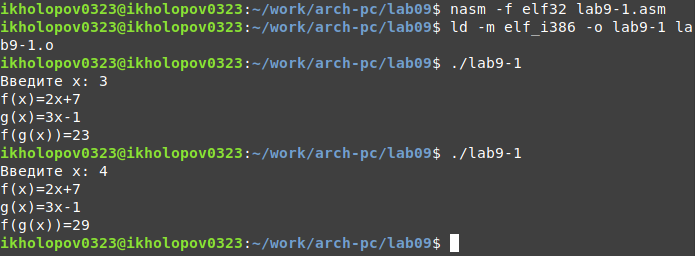

---
## Front matter
title: "ОТЧЕТ ПО ЛАБОРАТОРНОЙ РАБОТЕ №9"
subtitle: "дисциплина: Архитектура компьютера"
author: "Холопов Илья Алексеевич"

## Generic otions
lang: ru-RU
toc-title: "Содержание"

## Bibliography
bibliography: bib/cite.bib
csl: pandoc/csl/gost-r-7-0-5-2008-numeric.csl

## Pdf output format
toc: true # Table of contents
toc-depth: 2
lof: true # List of figures
lot: true # List of tables
fontsize: 12pt
linestretch: 1.5
papersize: a4
documentclass: scrreprt
## I18n polyglossia
polyglossia-lang:
  name: russian
  options:
    - spelling=modern
    - babelshorthands=true
polyglossia-otherlangs:
  name: english
## I18n babel
babel-lang: russian
babel-otherlangs: english
## Fonts
mainfont: PT Serif
romanfont: PT Serif
sansfont: PT Sans
monofont: PT Mono
mainfontoptions: Ligatures=TeX
romanfontoptions: Ligatures=TeX
sansfontoptions: Ligatures=TeX,Scale=MatchLowercase
monofontoptions: Scale=MatchLowercase,Scale=0.9
## Biblatex
biblatex: true
biblio-style: "gost-numeric"
biblatexoptions:
  - parentracker=true
  - backend=biber
  - hyperref=auto
  - language=auto
  - autolang=other*
  - citestyle=gost-numeric
## Pandoc-crossref LaTeX customization
figureTitle: "Рис."
tableTitle: "Таблица"
listingTitle: "Листинг"
lofTitle: "Список иллюстраций"
lotTitle: "Список таблиц"
lolTitle: "Листинги"
## Misc options
indent: true
header-includes:
  - \usepackage{indentfirst}
  - \usepackage{float} # keep figures where there are in the text
  - \floatplacement{figure}{H} # keep figures where there are in the text
---

# Цель работы

Приобретение навыков написания программ с использованием подпрограмм. Знакомство
с методами отладки при помощи GDB и его основными возможностями.

# Выполнение лабораторной работы

Создадим каталог для лабораторной работы № 9, перейдем в него и создадим файл lab9-1.asm (рис. @fig:001).

{#fig:001 width=70%}

рассмотрим программу вычисления арифметического выражения
$f(x) = 2g(x) + 7$, где $g(x) = 3x - 1$ с помощью подпрограмм \_calcul и \_subcalcul. В данном примере x вводится с
клавиатуры, а само выражение вычисляется в подпрограмме (рис. @fig:002).

{#fig:002 width=70%}

Создадим исполняемый файл и запустим его (рис. @fig:003).

{#fig:003 width=70%}

Создадим файл lab9-2.asm а запишем в него программу печати сообщения "Hello world!" (рис. @fig:004).

{#fig:004 width=70%}

Создадим исполняемый файл с отладочной информацией и запустим его в отладчике gdb(рис. @fig:005).

{#fig:005 width=70%}

Создадим точку останова, посмотрим дисассимилированный код программы, переключимся на отображение команд с Intel’овским синтаксисом и включим режим псевдографики для более удобного анализа программы (рис. @fig:006).

{#fig:006 width=70%}

Установим точку останова по адресу выведем и изменим содержимое памяти (@fig:007).

{#fig:007 width=70%}

Выведем в различных форматах (в шестнадцатеричном формате, в двоичном формате и в символьном виде) значение регистра ebx, завершим выполнение программы и выйдем из отладчика (рис. @fig:008).

{#fig:008 width=70%}

Скопируем файл lab8-2.asm, созданный при выполнении лабораторной работы №8,
с программой выводящей на экран аргументы командной строки в файл с именем
lab09-3.asm. Создадим исполняемый файл  и запустим отладчик с аргументами (рис. @fig:009).

{#fig:009 width=70%}

Исследуем расположение аргументов командной строки в стеке после запуска программы
с помощью gdb. Шаг изменения адреса равен 4, так как программа 32-битная (рис. @fig:010).

{#fig:010 width=70%}

Преобразуем программу из лабораторной работы №8 (Задание №1 для самостоятельной работы), реализовав вычисление значения функции $f(x)$ как подпрограмму (рис. @fig:011).

{#fig:011 width=70%}

Создадим файл task2.asm, запишем в файл текст программы, вычисляющей выражения $(3 + 2) ∗ 4 + 5$ (рис. @fig:012).

{#fig:012 width=70%}

При запуске данная программа дает неверный результат. С помощью отладчика GDB,
анализируя изменения значений регистров, определим ошибку и исправим ее (рис. @fig:013).

{#fig:013 width=70%}

Создадим и запустим исполняемый файл (рис. @fig:014)

{#fig:014 width=70%}

# Выводы

В ходе выполнения лабораторной работы были приобретены навыки написания программ с использованием подпрограмм. Таке были изучены  методы отладки при помощи GDB и его основные возможности.
