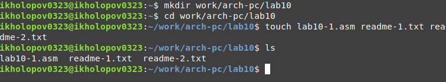
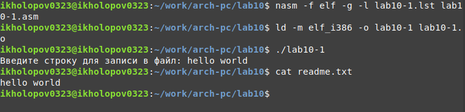
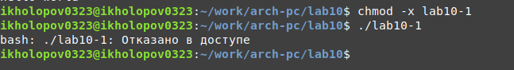
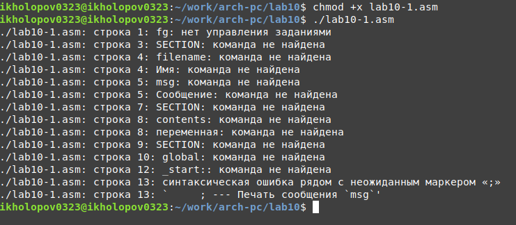
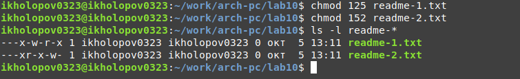
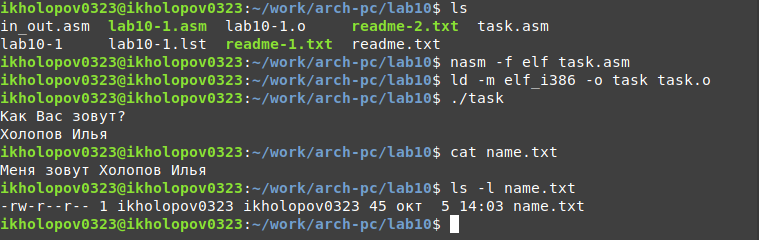

---
## Front matter
title: "ОТЧЕТ ПО ЛАБОРАТОРНОЙ РАБОТЕ №10"
subtitle: "дисциплина: Архитектура компьютера"
author: "Холопов Илья Алексеевич"

## Generic otions
lang: ru-RU
toc-title: "Содержание"

## Bibliography
bibliography: bib/cite.bib
csl: pandoc/csl/gost-r-7-0-5-2008-numeric.csl

## Pdf output format
toc: true # Table of contents
toc-depth: 2
lof: true # List of figures
lot: true # List of tables
fontsize: 12pt
linestretch: 1.5
papersize: a4
documentclass: scrreprt
## I18n polyglossia
polyglossia-lang:
  name: russian
  options:
    - spelling=modern
    - babelshorthands=true
polyglossia-otherlangs:
  name: english
## I18n babel
babel-lang: russian
babel-otherlangs: english
## Fonts
mainfont: PT Serif
romanfont: PT Serif
sansfont: PT Sans
monofont: PT Mono
mainfontoptions: Ligatures=TeX
romanfontoptions: Ligatures=TeX
sansfontoptions: Ligatures=TeX,Scale=MatchLowercase
monofontoptions: Scale=MatchLowercase,Scale=0.9
## Biblatex
biblatex: true
biblio-style: "gost-numeric"
biblatexoptions:
  - parentracker=true
  - backend=biber
  - hyperref=auto
  - language=auto
  - autolang=other*
  - citestyle=gost-numeric
## Pandoc-crossref LaTeX customization
figureTitle: "Рис."
tableTitle: "Таблица"
listingTitle: "Листинг"
lofTitle: "Список иллюстраций"
lotTitle: "Список таблиц"
lolTitle: "Листинги"
## Misc options
indent: true
header-includes:
  - \usepackage{indentfirst}
  - \usepackage{float} # keep figures where there are in the text
  - \floatplacement{figure}{H} # keep figures where there are in the text
---

# Цель работы

Приобретение навыков написания программ для работы с файлами.

# Выполнение лабораторной работы

Создадим каталог для программ лабораторной работы № 10, перейдем в него и создадим файлы lab10-1.asm, readme-1.txt и readme-2.txt (рис. @fig:001).

{#fig:001 width=70%}

Введем в файл lab10-1.asm текст программы (Программа записи в
файл сообщения). Создадим исполняемый файл и проверим его работу (рис. @fig:002).

{#fig:002 width=70%}

С помощью команды chmod изменим права доступа к исполняемому файлу lab10-1, запретив его выполнение. Попытаемся выполнить файл. В результате выводится сообщение об ошибке, так как мы запретили выполнять файл (рис. @fig:003).

{#fig:003 width=70%}

С помощью команды chmod изменим права доступа к файлу lab10-1.asm с исходным текстом программы, добавив права на исполнение. Попытаемся выполнить его. В результате файл запускается, но выводится сообщение об ошибке, так как в файле не содержатся инструкции для процессора (рис. @fig:004).

{#fig:004 width=70%}

Изменим права доступа для readme-1.txt (--x -w- r-x) и readme-2.txt (001 101 010) (рис. @fig:005).

{#fig:005 width=70%}

Напишем программу работающую по следующему алгоритму:

* Вывод приглашения "Как Вас зовут?"
* Ввести с клавиатуры свои фамилию и имя
* Создать файл с именем name.txt
* Записать в файл сообщение "Меня зовут"
* Дописать в файл строку введенную с клавиатуры
* Закрыть файл

Текст программы:

```asm
%include 'in_out.asm'

SECTION .data
	filename db 'name.txt', 0h ; Имя файла
	whatIsYourName db 'Как Вас зовут?',10,0h ; Сообщение
	myNameIs db 'Меня зовут ',0h
	myNameIsLen equ $-myNameIs

SECTION .bss
	contents resb 255 ; переменная для вводимой строки
	SECTION .text
	global _start

_start:
	; --- Печать сообщения 
	mov eax,whatIsYourName
	call sprint

	; ---- Запись введеной с клавиатуры строки в `contents`
	mov ecx, contents
	mov edx, 255
	call sread

	; --- Создание и Открытие существующего файла (`sys_creat`)
	mov ecx, 0644o ; установка прав доступа
	mov ebx, filename ; имя создаваемого файла
	mov eax, 8 ; номер системного вызова `sys_creat`
	int 80h ; вызов ядр

	; --- Запись дескриптора файла в `esi`
	mov esi, eax

	; --- Запись в файл "Меня зовут"
	mov edx,myNameIsLen
	mov ecx,myNameIs
	mov ebx,esi
	mov eax,4
	int 80h

	; --- Смещение
	mov edx, 2 ; значение смещения -- конец файла
	mov ecx, 0 ; смещение на 0 байт
	mov ebx, esi ; дескриптор файла
	mov eax, 19 ; номер системного вызова `sys_lseek`
	int 80h ; вызов ядра

	; --- Расчет длины введенной строки
	mov eax, contents ; в `eax` запишется количество
	call slen ; введенных байтов

	; --- Записываем в файл `contents` (`sys_write`)
	mov edx, eax
	mov ecx, contents
	mov ebx, esi
	mov eax, 4
	int 80h

	; --- Закрываем файл (`sys_close`)
	mov ebx, esi
	mov eax, 6
	int 80h
	call quit
```

Создадим и запустим исполняемый файл программы (рис. @fig:006).

{#fig:006 width=70%}

# Выводы

В ходе выполнения лабораторной работы были приобретены навыки написания программ для работы с файлами. Также были написаны программы создающие, открывающие файл и записывающие в файл.
